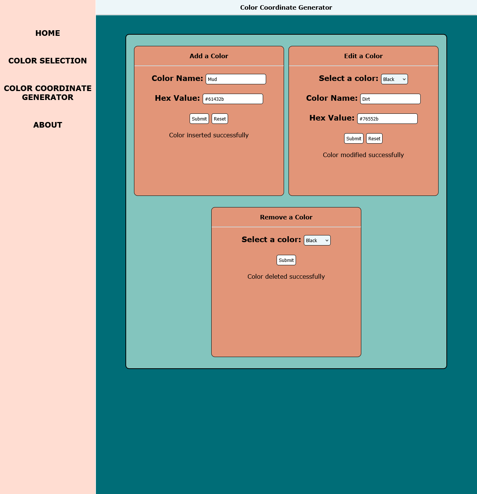
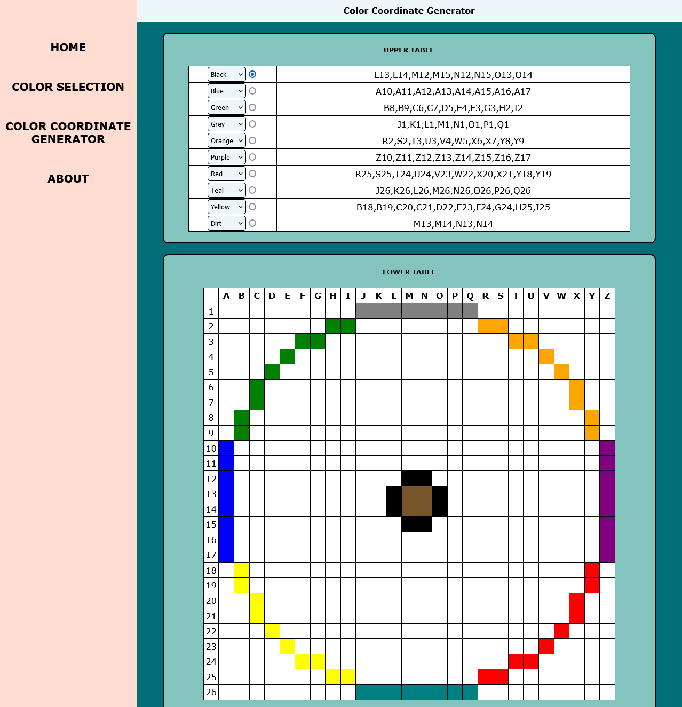
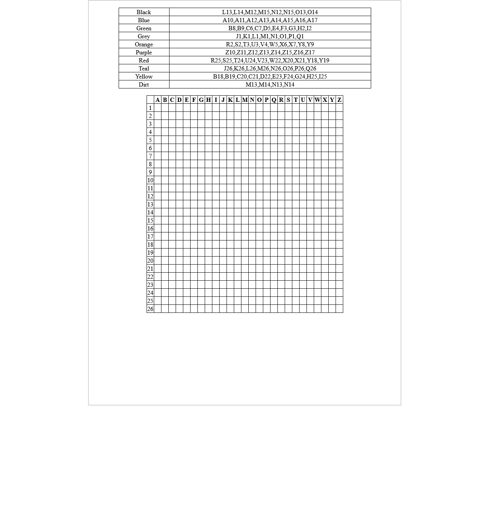

# Color Coordinate Generator Web Project
### Ayush Adhikari
<hr>

This project was completed as a part of CS312: Modern Web Development at Colorado State University. It is a color coordinate sheet generator that is actively used in Vision Therapy. The goal was to use web development tools and explore accessibility. The details of the project are outlined below.

### Project Structure
```bash
|--static [contains images for this markdown file and the webpages]  
|--about.html [The html file that includes the about section to be loaded by Ajax]
|--about.html [The html file that includes the color selection section to be loaded by Ajax; this defines the add, edit, and remove forms in the page and calls the crud.php file]
|--crud.php [Uses a get request to populate the dropdowns with the current colors in database and a post request to add, edit, or remove colors from the database]
|--database.db [Sqlite3 database that is used by PHP; contains only one table which gets populated and truncated]
|--generator.php [dynamically generates the upper and lower tables in the generator page with the numbers defined in the initial form; reads from the database to populate cells]
|--getForm.php [The html file that includes the generator form section to be loaded by Ajax]
|--homepage.html [The html file that includes the homepage section to be loaded by Ajax]
|--index.cc [The main css file used by the webpages to dictate the style]
|--index.js [The javascript that defines events and interactions of nodes in the webpages; it is mostly completed using Ajax, jQuery, and standard JS]
|--index.php [The main file that is loaded. It initially populates the database with 10 colors and defines the head and body section of the HTML page. Enables the use of SPA.]
|--navbar.html [The html file that includes the navbar section to be loaded by Ajax]
|--printTables.css [The css file that defines the style of the printable page]
```

### Outputs
In the color selection page, you can add a color (first div), edit a color (second div), and delete a color from the database (third div). When adding, colors cannot have the same name or hex values as existing entries and the hex_value must be appropriate. When editing colors, the desired colors can be selected from the dropdown. The two entries are for the new names and hex_values and follow the same rule as when adding. Finally, when deleting a color, it can be selected from the dropdown list. If there are only 2 colors remaining, you are unable to delete any more. The image below shows all three actions:


In the color generator page, after selecting the number of rows/columns and the number of colors to display, the next page will be dynamically generated. Each dropdown will display all colors in the database, which can be selected with the radio buttons. After selecting a color, it can be used to paint a cell in the lower table with that color. When a cell is colored, it appears in the second cell of that color in the upper table. If the color in the dropdown is changed, the colors in the lower table is also changed.  The image below shows all of the colors being utilized:


After the submit button is clicked in the color generator page, it generates a printable version of the two tables. The lower tables does not have any of the colors, but the upper table retains the color names and the cells associated with those colors. Therefore, someone is able to use the cell names to color in cells with the appropriate color. This is often used in vision therapy. The image below shows the printable voew:


### Tools Utilized
- PHP v8.3
- Sqlite3
- JavaScript
- Ajax
- JQuery
- HTML
- CSS

### Downloading and Compiling
Clone the repository using:
```bash
$ git clone https://github.com/ashsProjects/Color_Coordinate_Generator.git
```

To get PHP to work (for Windows):
1. Download the PHP zip; extract it and place it in "C://Program Files"
2. Add PHP path to enviroment variable
3. Inside the PHP folder, rename "php.ini-development" to php.ini and uncomment "extension=sqlite3"
4. Change to/Uncomment: 'sqlite3.extension_dir = "C:\Program Files\php\ext"' and 'extension_dir = "C:\Program Files\php\ext"'
5. Install the PHP Server extension for VSCode and, launch the server through localhost